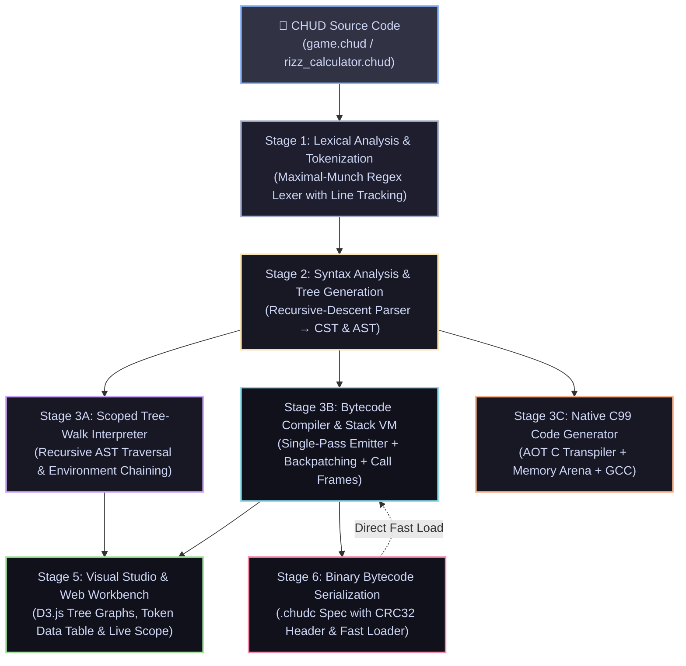
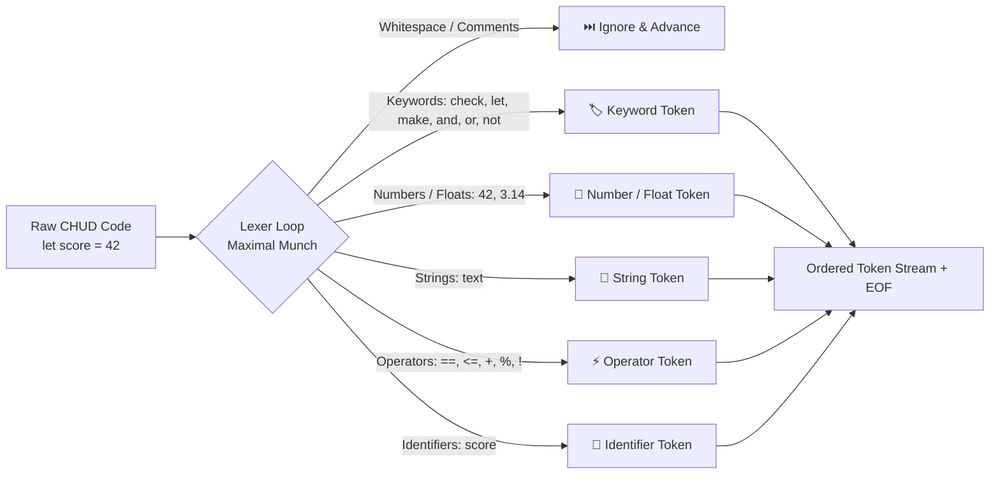
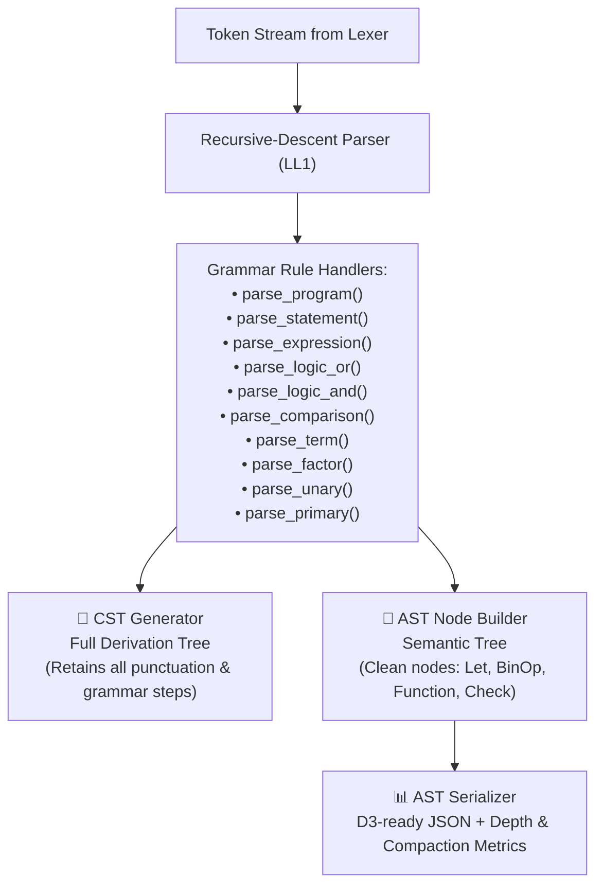
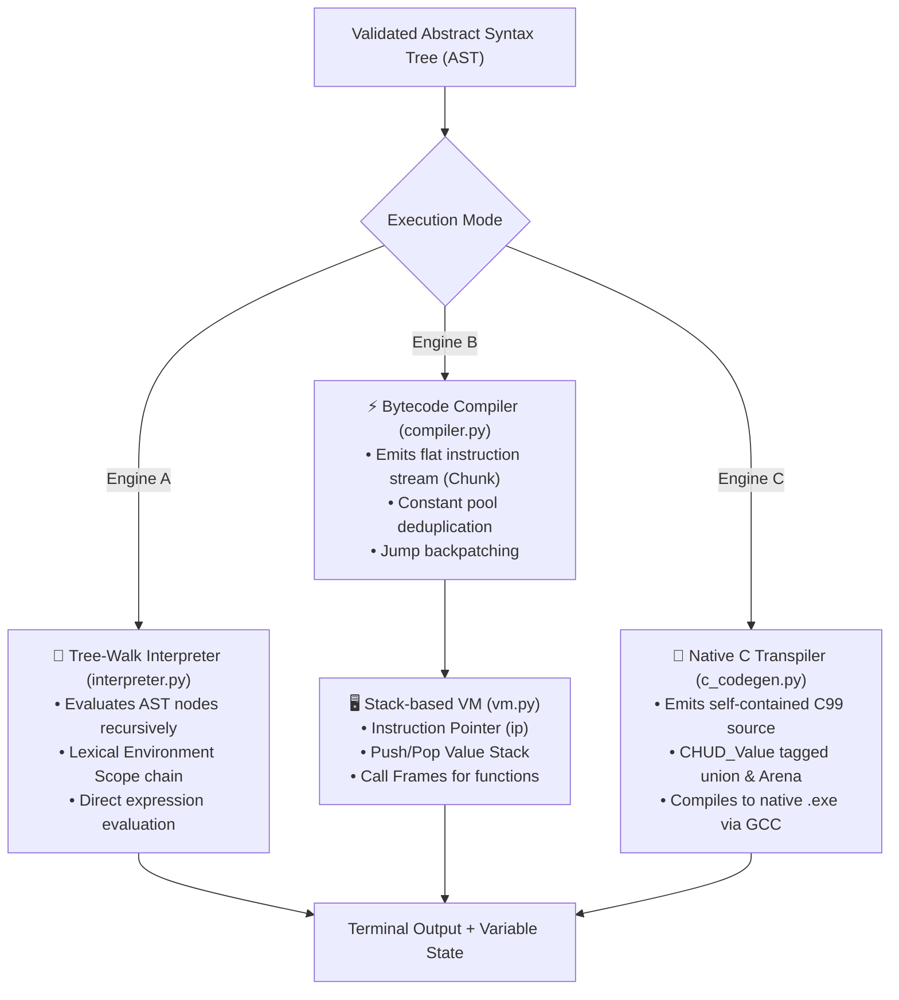
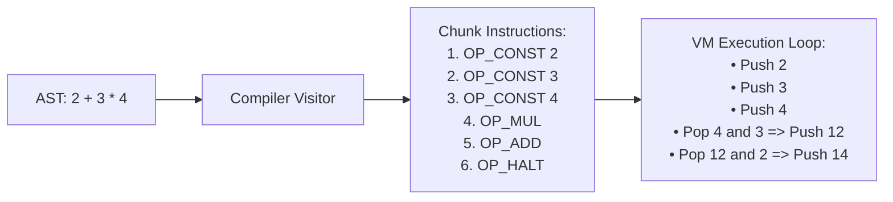
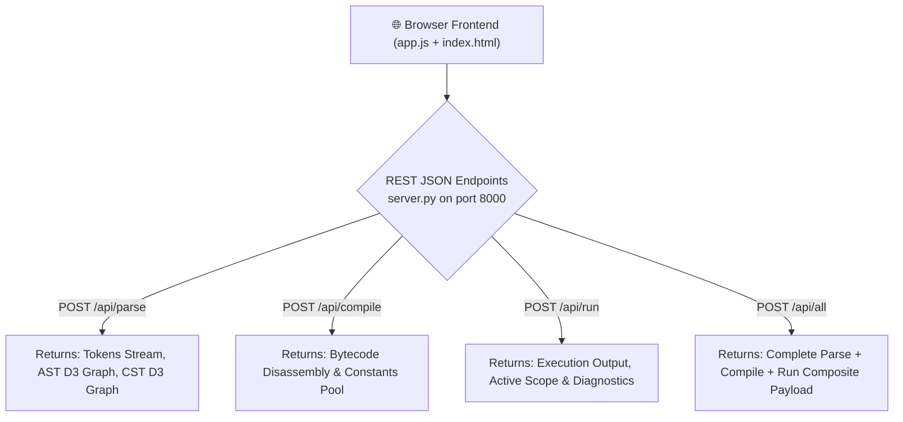
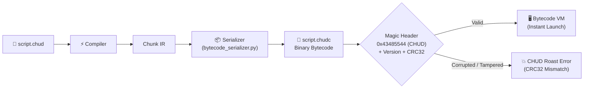
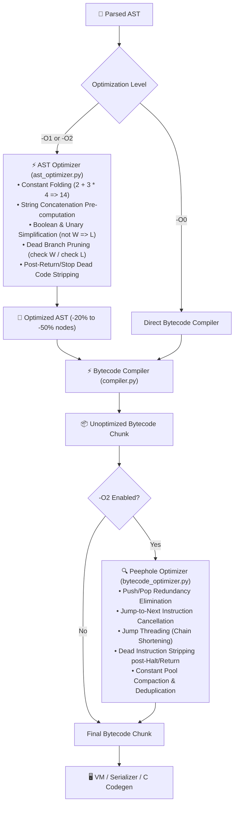

# 📘 CHUD Architecture & System Walkthrough

> **Simple Summary:**  
> **CHUD (Custom High-level User Development Language)** is an educational, full-stack programming language and visual compiler workbench built from scratch with zero external dependencies. It takes high-level source code and executes it through a complete 6-stage compiler pipeline—featuring **Lexical Analysis (Maximal Munch)**, **Recursive-Descent Parsing**, **Dual Tree Generation (CST & AST)**, **Triple Execution Engines** (an AST Tree-Walk Interpreter, a stack-based Bytecode Virtual Machine, and a Native C99 AOT Code Generator with 100% execution parity), and **Binary Bytecode Serialization (`.chudc`)** with CRC32 integrity verification, accompanied by a real-time web-based visual debugger.
>
> ⚡ **Zero External Dependencies:** Built 100% on Python's standard library (`http.server`, `json`, `re`, `urllib`, `struct`, `zlib`). Runs out of the box with zero `pip` installations.

---

## 🗺️ The 6-Stage Compilation & Execution Pipeline

Here is how CHUD source code travels from raw text to execution, native compilation, and visual inspection:



---

## 🔍 Step-by-Step Deep Dive: What Happens at Every Stage

---

### 🔤 Stage 1: Lexical Analysis & Tokenization
**Files involved:** [`lexer.py`](file:///d:/CHUD%20-%20Custom%20High-level%20User%20Development%20Language/lexer.py)

#### 🎯 Goal
Scan the raw source code text, strip whitespace and comments, and convert the character stream into an ordered sequence of typed **Token** objects with line-number metadata.



#### 💡 How It Works
1. **Maximal Munch Principle:** The lexer matches the longest possible valid token at any cursor position. For instance:
   - `==` is captured as `EQEQ`, never as two separate `=` (`EQ`) tokens.
   - `!=` is captured as `NEQ`, before `!` (`BANG`).
   - `<=` and `>=` take precedence over `<` and `>`.
   - `3.14` is matched as `FLOAT`, rather than `NUMBER` + `.` + `NUMBER`.
2. **Priority-Ordered Token Patterns:** Regex patterns are evaluated in strict precedence (`FLOAT` $\rightarrow$ `NUMBER` $\rightarrow$ `STRING` $\rightarrow$ `EQEQ` $\rightarrow$ `NEQ` $\rightarrow$ `BANG` $\rightarrow$ `LE` $\rightarrow$ `GE` $\rightarrow$ `EQ` $\rightarrow$ Single Character Operators $\rightarrow$ `PERCENT` $\rightarrow$ `IDENTIFIER`).
3. **Keyword Discrimination:** Any word matching the identifier pattern is checked against the internal `KEYWORDS` dictionary (`check`, `otherwise`, `keep`, `loop`, `let`, `make`, `return`, `yap`, `hear`, `stop`, `skip`, `W`, `L`, `and`, `or`, `not`). If found, it receives a dedicated keyword token type; otherwise, it remains an `IDENTIFIER`.
4. **Line-Numbered Error Diagnostics:** Every token retains its 1-indexed source line. If an unknown character is encountered, a descriptive `LexError` is raised with the line number and diagnostic feedback.

---

### 🌳 Stage 2: Syntax Analysis & Grammar Parsing (CST & AST)
**Files involved:** [`parser.py`](file:///d:/CHUD%20-%20Custom%20High-level%20User%20Development%20Language/parser.py), [`ast_nodes.py`](file:///d:/CHUD%20-%20Custom%20High-level%20User%20Development%20Language/ast_nodes.py), [`cst_generator.py`](file:///d:/CHUD%20-%20Custom%20High-level%20User%20Development%20Language/cst_generator.py), [`ast_serializer.py`](file:///d:/CHUD%20-%20Custom%20High-level%20User%20Development%20Language/ast_serializer.py)

#### 🎯 Goal
Validate the token stream against the formal CHUD grammar using **Recursive Descent Parsing** and generate two distinct structural trees: the **Concrete Syntax Tree (CST)** and the **Abstract Syntax Tree (AST)**.



#### 💡 How It Works
1. **Recursive Descent Architecture:** Each non-terminal grammar rule is mapped to a dedicated parsing method. The parser uses `peek()`, `advance()`, and `expect(token_type)` to consume tokens without backtracking.
2. **Operator Precedence Cascade:** Mathematical and logical operators are structured hierarchically to enforce standard PEMDAS and relational ordering:
   $$\text{Logic Or } (\text{or}) \longrightarrow \text{Logic And } (\text{and}) \longrightarrow \text{Comparison } (==, !=, <, >, <=, >=) \longrightarrow \text{Term } (+, -) \longrightarrow \text{Factor } (*, /, \%) \longrightarrow \text{Unary } (+, -, !, \text{not}) \longrightarrow \text{Primary}$$
3. **CST vs. AST Distinction:**
   - **CST (Concrete Syntax Tree):** Captures every lexical artifact (braces, parentheses, semicolons, grammar non-terminals) for complete compiler-theoretical derivation.
   - **AST (Abstract Syntax Tree):** Distills the syntax down to pure semantic nodes ([`ProgramNode`](file:///d:/CHUD%20-%20Custom%20High-level%20User%20Development%20Language/ast_nodes.py), [`AssignNode`](file:///d:/CHUD%20-%20Custom%20High-level%20User%20Development%20Language/ast_nodes.py), [`BinOpNode`](file:///d:/CHUD%20-%20Custom%20High-level%20User%20Development%20Language/ast_nodes.py), [`CheckNode`](file:///d:/CHUD%20-%20Custom%20High-level%20User%20Development%20Language/ast_nodes.py), [`FunctionNode`](file:///d:/CHUD%20-%20Custom%20High-level%20User%20Development%20Language/ast_nodes.py)), stripping away syntactic fluff.
4. **AST Serialization & Stats:** `ast_serializer.py` computes tree statistics (Node Count, Maximum Tree Depth, Statement Counts, and CST-to-AST compactness percentage) for real-time visualization.

---

### ⚙️ Stage 3: Triple Execution Engine (Interpreter vs. Bytecode VM vs. Native C AOT)
**Files involved:** [`interpreter.py`](file:///d:/CHUD%20-%20Custom%20High-level%20User%20Development%20Language/interpreter.py), [`compiler.py`](file:///d:/CHUD%20-%20Custom%20High-level%20User%20Development%20Language/compiler.py), [`vm.py`](file:///d:/CHUD%20-%20Custom%20High-level%20User%20Development%20Language/vm.py), [`c_codegen.py`](file:///d:/CHUD%20-%20Custom%20High-level%20User%20Development%20Language/c_codegen.py), [`test_vm_parity.py`](file:///d:/CHUD%20-%20Custom%20High-level%20User%20Development%20Language/test_vm_parity.py), [`test_native_codegen.py`](file:///d:/CHUD%20-%20Custom%20High-level%20User%20Development%20Language/test_native_codegen.py)

#### 🎯 Goal
Execute the validated program using three fundamentally different runtime paradigms and guarantee 100% execution output parity.



#### 💡 Comparative Engine Architecture:

| Feature | Tree-Walk Interpreter (`interpreter.py`) | Bytecode Virtual Machine (`compiler.py` + `vm.py`) | Native AOT Compiler (`c_codegen.py` $\rightarrow$ `.exe`) |
| :--- | :--- | :--- | :--- |
| **Execution Model** | Recursive visitor on AST node hierarchy | Linear instruction dispatch loop on a stack machine | Compiled machine code running natively on bare metal |
| **Intermediate Representation** | In-Memory AST Node Graph | Flat `Chunk` of numeric OpCodes & Constants | Self-contained C99 source string with embedded runtime |
| **Memory / Variable State** | Chained `Environment` symbol table dictionaries | Local/Global variable tables & Value Stack slots | Native C stack variables & `CHUD_Value` Tagged Unions |
| **Function Invocations** | Python recursive calls creating new `Environment` instances | Discrete `CallFrame` stack with isolated `ip` and base pointer | Native C function call stack with zero overhead |
| **Loop / Jump Handling** | Native Python `while` / `for` loop traversal | `JUMP` & `JUMP_IF_FALSE` relative bytecode offsets | Native C `while` / `for` / `break` / `continue` assembly loops |
| **Safety Guard** | 100,000 max loop iteration threshold | Instruction-level boundary & stack underflow protection | Signal-safe panic traps and automatic memory arena tracker |

---

### ⚡ Stage 4: Bytecode Compilation & Stack-Based VM Deep Dive
**Files involved:** [`bytecode.py`](file:///d:/CHUD%20-%20Custom%20High-level%20User%20Development%20Language/bytecode.py), [`compiler.py`](file:///d:/CHUD%20-%20Custom%20High-level%20User%20Development%20Language/compiler.py), [`vm.py`](file:///d:/CHUD%20-%20Custom%20High-level%20User%20Development%20Language/vm.py)

#### 🎯 Goal
Flatten complex hierarchical control flow, arithmetic, and lexical function calls into a linear bytecode sequence executable by an industrial-style virtual machine.



#### 💡 Key VM & Compiler Mechanisms:
1. **Bytecode OpCode Set:** Clean, modular instructions defining language operations:
   - **Stack & Constants:** `PUSH_CONST`, `LOAD_VAR`, `STORE_VAR`, `ASSIGN_VAR`, `POP`
   - **Arithmetic & Logic:** `ADD`, `SUB`, `MUL`, `DIV`, `MOD`, `EQ`, `NEQ`, `LT`, `GT`, `LTE`, `GTE`, `NEG`, `POS`, `NOT`
   - **Control Flow:** `JUMP`, `JUMP_IF_FALSE`, `HALT` (short-circuiting for `and`/`or` using conditional jumps)
   - **I/O & Subroutines:** `PRINT`, `HEAR`, `CALL`, `RETURN`
   - **Arrays & Lists:** `BUILD_LIST` (construct dynamic array), `LOAD_INDEX` (`arr[i]`), `STORE_INDEX` (`arr[i] = val`)
2. **Backpatching for Jumps:** When compiling `check` conditionals or `keep` loops, forward target jump addresses are unknown. The compiler emits dummy placeholder operands, tracks the emitted position, compiles the body, and "backpatches" the exact relative jump offset.
3. **Loop `stop` (Break) & `skip` (Continue) Patch Stacks:** Nested loops maintain stacks of unresolved break and continue jumps. When the loop finishes, pending `stop` statements are patched to jump past the loop exit, while `skip` statements are patched to jump to the condition check (for `keep` loops) or the update expression (for classic `loop` headers).
4. **CallFrame Subroutine Architecture:** When `CALL` executes, a new `CallFrame` is pushed containing the target `CHUDFunctionProto`, its own instruction pointer (`ip`), and local argument values. `RETURN` unwinds the top frame and restores caller state.
5. **Dynamic List & Array Primitives:** Native 0-indexed dynamic arrays with literal syntax `[...]`, multi-dimensional indexing `matrix[i][j]`, indexed mutation `arr[i] = x`, and standard built-in functions (`len()`, `push()`, `pop()`). Bound errors and type violations are trapped with line-accurate diagnostic roasts.

---

### 🖥️ Stage 5: Interactive Visual Studio & Zero-Dependency HTTP Server
**Files involved:** [`server.py`](file:///d:/CHUD%20-%20Custom%20High-level%20User%20Development%20Language/server.py), [`index.html`](file:///d:/CHUD%20-%20Custom%20High-level%20User%20Development%20Language/index.html), [`style.css`](file:///d:/CHUD%20-%20Custom%20High-level%20User%20Development%20Language/style.css), [`app.js`](file:///d:/CHUD%20-%20Custom%20High-level%20User%20Development%20Language/app.js)

#### 🎯 Goal
Provide a modern developer studio for real-time visual inspection of compiler stages, token streams, syntax trees, and live runtime memory.



#### 💡 Visual Studio Capabilities:
1. **Split-Pane IDE Layout:** Left-hand code editor with line gutter and syntax tracking; right-hand interactive inspector tabs.
2. **Interactive D3.js Tree Graphs:** Dynamic vector trees for both CST and AST with pan/zoom controls, node searching, collapsible branches, and SVG export.
3. **Lexical Tokens Pro Data Table:** Searchable, category-filtered table displaying token indices, types, lexemes, categories, and one-click source line jumping.
4. **Interactive JSON Tree Inspector:** Collapsible JSON tree viewer with live payload metrics (Node Count, Tree Depth, Payload Size in KB) and JSON export.
5. **Interactive Input Modal:** Graceful browser-native modal prompts for `hear` statements with type coercion.
6. **Multi-Theme Engine:** Space Dark, Studio Light, Midnight Blue, and Titanium Monochrome themes.

---

### 📦 Stage 6: Binary Bytecode Serialization (`.chudc`) & Fast AOT Loading
**Files involved:** [`bytecode_serializer.py`](file:///d:/CHUD%20-%20Custom%20High-level%20User%20Development%20Language/bytecode_serializer.py), [`bytecode.py`](file:///d:/CHUD%20-%20Custom%20High-level%20User%20Development%20Language/bytecode.py), [`chud.py`](file:///d:/CHUD%20-%20Custom%20High-level%20User%20Development%20Language/chud.py), [`test_bytecode_serialization.py`](file:///d:/CHUD%20-%20Custom%20High-level%20User%20Development%20Language/test_bytecode_serialization.py)

#### 🎯 Goal
Persist compiled CHUD bytecode into a compact, cross-platform binary format (`.chudc`) with hardware-independent Little-Endian encoding, tagged constant pools, recursive closure serialization, and CRC32 cryptographic integrity verification. This allows instant AOT execution that bypasses lexing, parsing, and AST compilation entirely.



#### 💡 The `.chudc` Binary Specification:
1. **10-Byte Fixed Binary Header:**
   - `[0..3]`: Magic Bytes `0x43485544` (`b"CHUD"`).
   - `[4..5]`: Format Version (`uint16`, Little-Endian). Current version: `1`.
   - `[6..9]`: Checksum (`uint32`, Little-Endian) — computed via IEEE 802.3 `CRC32` over all trailing payload bytes.
2. **Tagged Constant Pool Encoding:**
   - `Count` (`uint32`): Total number of constants in the pool.
   - Each constant is prefixed by a 1-byte type tag:
     - `TAG_INT` (`0x01`): Followed by `int64` (`<q`).
     - `TAG_FLOAT` (`0x02`): Followed by `float64` (`<d`).
     - `TAG_STRING` (`0x03`): Followed by length `uint32` and UTF-8 encoded byte array.
     - `TAG_BOOL` (`0x04`): Followed by `uint8` (`0` or `1`).
     - `TAG_NONE` (`0x05`): No payload bytes.
     - `TAG_PROTO` (`0x06`): Function prototype containing name, arity, param names list, and a **recursive serialized `Chunk`** payload (supporting arbitrarily nested functions and closures).
3. **Tagged Instruction Stream:**
   - `Count` (`uint32`): Total number of instructions.
   - Each instruction encodes `OpCode ID` (`uint8`), `Line Number` (`uint32`), followed by an `Argument Tag`:
     - `ARG_NONE` (`0x00`): No operand.
     - `ARG_INT` (`0x01`): `int64` operand.
     - `ARG_STR` (`0x02`): Length-prefixed UTF-8 string operand.
     - `ARG_TUPLE_STR_INT` (`0x03`): Length-prefixed string + `int64` (e.g. for function calls with arity metadata).
4. **Instant Zero-Overhead CLI Auto-Loader:**
   - `chud.py` inspects the initial 4 bytes of any target file. If `b"CHUD"` is detected, it immediately bypasses lexing, parsing, and AST generation, loads the deserialized bytecode chunk directly into `VM`, and executes with full runtime speed.

---

### 🚀 Stage 7: Multi-Tier Compiler Optimization Engine (`ast_optimizer.py` + `bytecode_optimizer.py`)
**Files involved:** [`ast_optimizer.py`](file:///d:/CHUD%20-%20Custom%20High-level%20User%20Development%20Language/ast_optimizer.py), [`bytecode_optimizer.py`](file:///d:/CHUD%20-%20Custom%20High-level%20User%20Development%20Language/bytecode_optimizer.py), [`chud.py`](file:///d:/CHUD%20-%20Custom%20High-level%20User%20Development%20Language/chud.py), [`test_optimizer.py`](file:///d:/CHUD%20-%20Custom%20High-level%20User%20Development%20Language/test_optimizer.py)

#### 🎯 Goal
Accelerate execution and reduce bytecode size through a composable, multi-tier optimization pipeline supporting standard compiler levels (`-O0`, `-O1`, `-O2`) with real-time telemetry metrics.



#### 💡 Optimization Passes & Capabilities:
1. **Tier 1 — AST Constant Folding & Algebraic Identities:**
   - Evaluates static numeric, boolean, and string binary expressions at compile time.
   - Simplifies identity operations (`x + 0` $\rightarrow$ `x`, `1 * x` $\rightarrow$ `x`, `x - 0` $\rightarrow$ `x`).
   - Folds double negations (`!(!x)` $\rightarrow$ `x`).
2. **Tier 1 — Dead Branch & Statement Elimination:**
   - Evaluates `check W` $\rightarrow$ inlines then-branch and drops otherwise-branch.
   - Evaluates `check L` $\rightarrow$ drops then-branch and inlines otherwise-branch.
   - Drops `keep L` loops entirely.
   - Strips unreachable statements appearing after an unconditional `return`, `stop`, or `skip`.
3. **Tier 2 — Bytecode Peephole Sliding Window:**
   - **Push/Pop Elimination:** Detects and removes redundant `[PUSH_CONST, POP]` sequences when untargeted by jumps.
   - **Jump-to-Next Elimination:** Strips `JUMP` instructions targeting the immediately following instruction.
   - **Jump Threading:** Short-circuits unconditional jump chains directly to the ultimate target address.
   - **Dead Bytecode Stripping:** Removes untargeted instructions following `HALT`, `RETURN`, or unconditional `JUMP`.
4. **Telemetry & Benchmark Reporting (`--opt-stats`):**
   - Displays real-time AST node reduction %, constant folding counts, dead branch counts, instruction delta %, and peephole passes run.

---

## 📁 Complete File Directory Reference

| File Path | Primary Function |
| :--- | :--- |
| [`lexer.py`](file:///d:/CHUD%20-%20Custom%20High-level%20User%20Development%20Language/lexer.py) | Maximal-munch lexical analyzer converting raw CHUD source into typed, line-numbered `Token` streams. |
| [`parser.py`](file:///d:/CHUD%20-%20Custom%20High-level%20User%20Development%20Language/parser.py) | LL(1)-style recursive-descent parser constructing hierarchical AST nodes and validating syntax rules. |
| [`ast_nodes.py`](file:///d:/CHUD%20-%20Custom%20High-level%20User%20Development%20Language/ast_nodes.py) | Object-oriented AST node schema definitions for statements, expressions, control blocks, and functions. |
| [`ast_optimizer.py`](file:///d:/CHUD%20-%20Custom%20High-level%20User%20Development%20Language/ast_optimizer.py) | AST-level constant folding, dead branch pruning, algebraic simplifications, and dead code elimination. |
| [`bytecode_optimizer.py`](file:///d:/CHUD%20-%20Custom%20High-level%20User%20Development%20Language/bytecode_optimizer.py) | Bytecode sliding-window peephole optimizer, jump threading, dead instruction stripping, and constant pool compaction. |
| [`cst_generator.py`](file:///d:/CHUD%20-%20Custom%20High-level%20User%20Development%20Language/cst_generator.py) | Full Concrete Syntax Tree generator capturing all grammar non-terminals, tokens, and punctuation. |
| [`ast_serializer.py`](file:///d:/CHUD%20-%20Custom%20High-level%20User%20Development%20Language/ast_serializer.py) | D3-compliant tree serializer with node hierarchy formatting, tree depth calculation, and compactness metrics. |
| [`interpreter.py`](file:///d:/CHUD%20-%20Custom%20High-level%20User%20Development%20Language/interpreter.py) | Scoped Tree-Walk Interpreter with lexical `Environment` chaining, runtime type-checking, and loop safety limits. |
| [`compiler.py`](file:///d:/CHUD%20-%20Custom%20High-level%20User%20Development%20Language/compiler.py) | Single-pass bytecode compiler translating AST into bytecode chunks with constant pooling and jump backpatching. |
| [`vm.py`](file:///d:/CHUD%20-%20Custom%20High-level%20User%20Development%20Language/vm.py) | Stack-based Virtual Machine with `CallFrame` subroutine management, instruction dispatch, and runtime stack. |
| [`bytecode.py`](file:///d:/CHUD%20-%20Custom%20High-level%20User%20Development%20Language/bytecode.py) | Bytecode `OpCode` definitions, numeric IDs, `Chunk` container, `CHUDFunctionProto`, and human-readable disassembler. |
| [`bytecode_serializer.py`](file:///d:/CHUD%20-%20Custom%20High-level%20User%20Development%20Language/bytecode_serializer.py) | Cross-platform binary serializer and fast deserializer for `.chudc` files with CRC32 integrity checks. |
| [`c_codegen.py`](file:///d:/CHUD%20-%20Custom%20High-level%20User%20Development%20Language/c_codegen.py) | Standalone C99 code generator and AOT compiler producing native bare-metal executables via GCC. |
| [`server.py`](file:///d:/CHUD%20-%20Custom%20High-level%20User%20Development%20Language/server.py) | Zero-dependency HTTP server (`http.server`) hosting the studio web client and REST JSON API endpoints. |
| [`chud.py`](file:///d:/CHUD%20-%20Custom%20High-level%20User%20Development%20Language/chud.py) | Standalone CLI entrypoint supporting `.chud` scripts, `.chudc` binaries, `-O` optimization flags, `--opt-stats`, and REPL. |
| [`index.html`](file:///d:/CHUD%20-%20Custom%20High-level%20User%20Development%20Language/index.html) | Split-pane Studio Web IDE user interface with D3 canvas, token data table, and JSON inspector. |
| [`style.css`](file:///d:/CHUD%20-%20Custom%20High-level%20User%20Development%20Language/style.css) | Custom styling, CSS variable design systems, responsive split panes, and multi-theme definitions. |
| [`app.js`](file:///d:/CHUD%20-%20Custom%20High-level%20User%20Development%20Language/app.js) | Frontend controller managing D3 graph rendering, zoom/pan controls, token filtering, and API communication. |
| [`test_all.py`](file:///d:/CHUD%20-%20Custom%20High-level%20User%20Development%20Language/test_all.py) | End-to-end integration test suite verifying Lexer, Parser, CST, AST, Interpreter, and Server components. |
| [`test_optimizer.py`](file:///d:/CHUD%20-%20Custom%20High-level%20User%20Development%20Language/test_optimizer.py) | Unit & parity test suite for Phase 4 AST constant folding, dead branch pruning, and bytecode peephole optimizations. |
| [`test_vm_parity.py`](file:///d:/CHUD%20-%20Custom%20High-level%20User%20Development%20Language/test_vm_parity.py) | Automated parity test suite verifying identical execution between the Tree-Walk Interpreter and Bytecode VM. |
| [`test_native_codegen.py`](file:///d:/CHUD%20-%20Custom%20High-level%20User%20Development%20Language/test_native_codegen.py) | Comprehensive test suite for Native C99 transpilation, runtime arena memory, and GCC compilation. |
| [`test_bytecode_serialization.py`](file:///d:/CHUD%20-%20Custom%20High-level%20User%20Development%20Language/test_bytecode_serialization.py) | Binary `.chudc` test suite verifying serialization, deserialization, CRC32 integrity, and VM execution parity. |
| [`test_pipeline.py`](file:///d:/CHUD%20-%20Custom%20High-level%20User%20Development%20Language/test_pipeline.py) | Multi-stage pipeline verification suite testing parsing, serialization, and compilation stages. |
| [`test_server.py`](file:///d:/CHUD%20-%20Custom%20High-level%20User%20Development%20Language/test_server.py) | Unit tests verifying HTTP endpoints (`/api/parse`, `/api/compile`, `/api/run`, `/api/all`). |
| [`game.chud`](file:///d:/CHUD%20-%20Custom%20High-level%20User%20Development%20Language/game.chud) | Interactive number guessing game demonstrating loops, conditionals, input, and state mutation in CHUD. |
| [`rizz_calculator.chud`](file:///d:/CHUD%20-%20Custom%20High-level%20User%20Development%20Language/rizz_calculator.chud) | Sample CHUD script demonstrating functions, arithmetic evaluation, and conditional branching. |

---

## 🚀 Quick Commands Cheatsheet

```bash
# 1. Launch the Interactive Visualizer Studio Web Workbench
python server.py
# -> Open http://localhost:8000 in your browser (or python server.py 8080 for custom port)

# 2. Run CHUD Script with Full Optimization & Telemetry (-O2 --opt-stats)
python chud.py rizz_calculator.chud --vm -O2 --opt-stats

# 3. Compile to Optimized Binary Bytecode (.chudc) and Execute Instantly
python chud.py --emit-bc rizz_calculator.chud -O2 -o rizz_calculator.chudc
python chud.py rizz_calculator.chudc

# 4. Compile to Native Standalone Executable (.exe) via C Generator & GCC
python chud.py -c rizz_calculator.chud -o rizz_calc.exe
./rizz_calc.exe

# 5. Launch the Interactive CHUD REPL
python chud.py

# 6. Run Complete Test Matrix
python test_all.py
python test_optimizer.py
python test_vm_parity.py
python test_native_codegen.py
python test_bytecode_serialization.py
```
