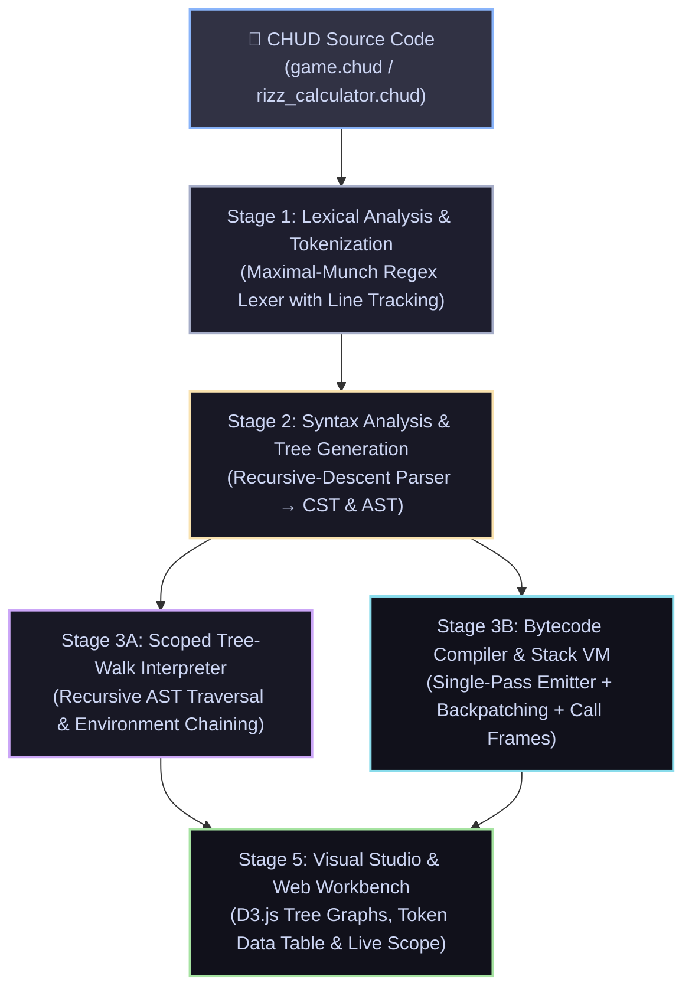
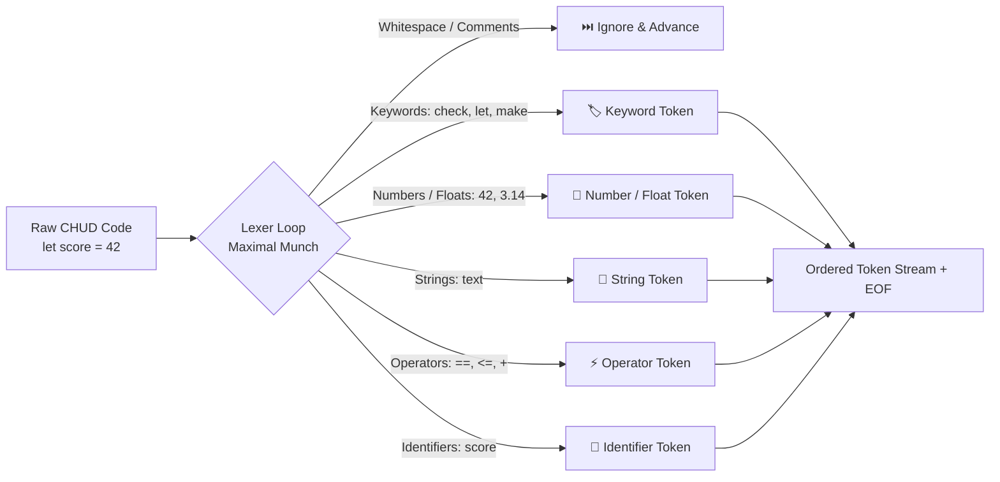
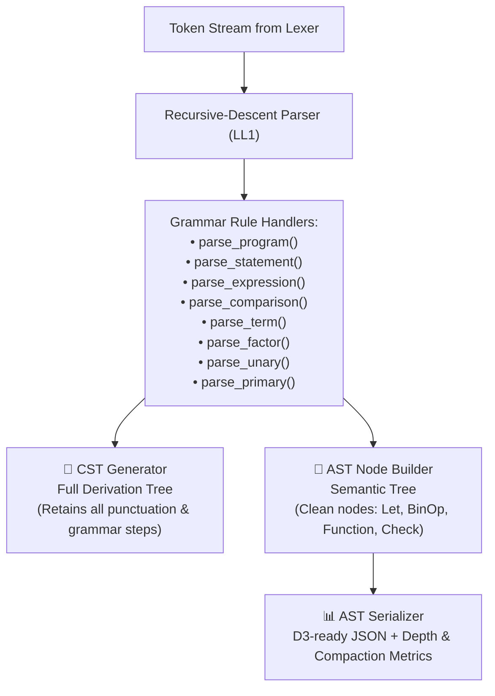
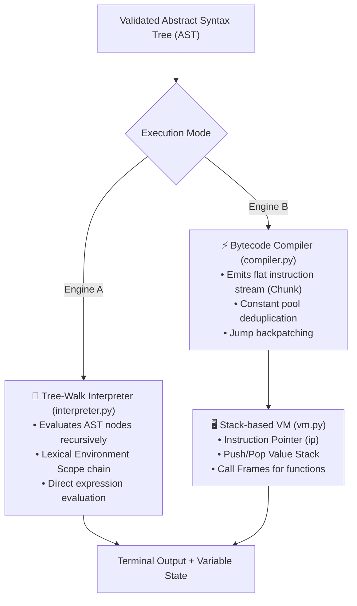
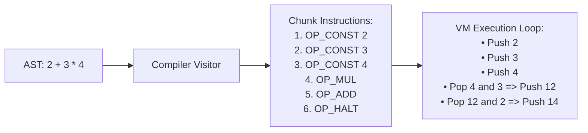
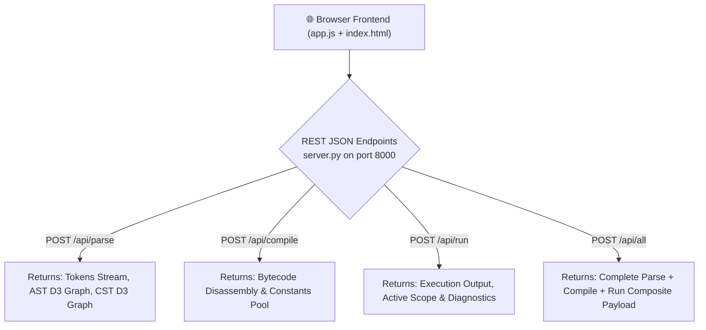

# 📘 CHUD Architecture & System Walkthrough

> **Simple Summary:**  
> **CHUD (Custom High-level User Development Language)** is an educational, full-stack programming language and visual compiler workbench built from scratch with zero external dependencies. It takes high-level source code and executes it through a complete 5-stage compiler pipeline—featuring **Lexical Analysis (Maximal Munch)**, **Recursive-Descent Parsing**, **Dual Tree Generation (CST & AST)**, and **Dual Execution Engines** (an AST Tree-Walk Interpreter and a stack-based Bytecode Compiler & Virtual Machine with 100% execution parity), accompanied by a real-time web-based visual debugger.
>
> ⚡ **Zero External Dependencies:** Built 100% on Python's standard library (`http.server`, `json`, `re`, `urllib`). Runs out of the box with zero `pip` installations.

---

## 🗺️ The 5-Stage Compilation & Execution Pipeline

Here is how CHUD source code travels from raw text to execution and visual inspection:



---

## 🔍 Step-by-Step Deep Dive: What Happens at Every Stage

---

### 🔤 Stage 1: Lexical Analysis & Tokenization
**Files involved:** [`lexer.py`](file:///d:/CHUD%20-%20Custom%20High-level%20User%20Development%20Language/lexer.py)

#### 🎯 Goal
Scan the raw source code text, strip whitespace and comments, and convert the character stream into an ordered sequence of typed **Token** objects with line-number metadata.



#### 💡 How It Works
1. **Maximal Munch Principle:** The lexer matches the longest possible valid token at any cursor position. For instance:
   - `==` is captured as `EQEQ`, never as two separate `=` (`EQ`) tokens.
   - `<=` and `>=` take precedence over `<` and `>`.
   - `3.14` is matched as `FLOAT`, rather than `NUMBER` + `.` + `NUMBER`.
2. **Priority-Ordered Token Patterns:** Regex patterns are evaluated in strict precedence (`FLOAT` $\rightarrow$ `NUMBER` $\rightarrow$ `STRING` $\rightarrow$ `EQEQ` $\rightarrow$ `NEQ` $\rightarrow$ `LE` $\rightarrow$ `GE` $\rightarrow$ `EQ` $\rightarrow$ Single Character Operators $\rightarrow$ `IDENTIFIER`).
3. **Keyword Discrimination:** Any word matching the identifier pattern is checked against the internal `KEYWORDS` dictionary (`check`, `otherwise`, `keep`, `loop`, `let`, `make`, `return`, `yap`, `hear`, `stop`, `W`, `L`). If found, it receives a dedicated keyword token type; otherwise, it remains an `IDENTIFIER`.
4. **Line-Numbered Error Diagnostics:** Every token retains its 1-indexed source line. If an unknown character is encountered, a descriptive `LexError` is raised with the line number and diagnostic feedback.

---

### 🌳 Stage 2: Syntax Analysis & Grammar Parsing (CST & AST)
**Files involved:** [`parser.py`](file:///d:/CHUD%20-%20Custom%20High-level%20User%20Development%20Language/parser.py), [`ast_nodes.py`](file:///d:/CHUD%20-%20Custom%20High-level%20User%20Development%20Language/ast_nodes.py), [`cst_generator.py`](file:///d:/CHUD%20-%20Custom%20High-level%20User%20Development%20Language/cst_generator.py), [`ast_serializer.py`](file:///d:/CHUD%20-%20Custom%20High-level%20User%20Development%20Language/ast_serializer.py)

#### 🎯 Goal
Validate the token stream against the formal CHUD grammar using **Recursive Descent Parsing** and generate two distinct structural trees: the **Concrete Syntax Tree (CST)** and the **Abstract Syntax Tree (AST)**.



#### 💡 How It Works
1. **Recursive Descent Architecture:** Each non-terminal grammar rule is mapped to a dedicated parsing method. The parser uses `peek()`, `advance()`, and `expect(token_type)` to consume tokens without backtracking.
2. **Operator Precedence Cascade:** Mathematical and logical operators are structured hierarchically to enforce standard PEMDAS and relational ordering:
   $$\text{Comparison } (==, !=, <, >, <=, >=) \longrightarrow \text{Term } (+, -) \longrightarrow \text{Factor } (*, /) \longrightarrow \text{Unary } (+, -) \longrightarrow \text{Primary}$$
3. **CST vs. AST Distinction:**
   - **CST (Concrete Syntax Tree):** Captures every lexical artifact (braces, parentheses, semicolons, grammar non-terminals) for complete compiler-theoretical derivation.
   - **AST (Abstract Syntax Tree):** Distills the syntax down to pure semantic nodes ([`ProgramNode`](file:///d:/CHUD%20-%20Custom%20High-level%20User%20Development%20Language/ast_nodes.py), [`AssignNode`](file:///d:/CHUD%20-%20Custom%20High-level%20User%20Development%20Language/ast_nodes.py), [`BinOpNode`](file:///d:/CHUD%20-%20Custom%20High-level%20User%20Development%20Language/ast_nodes.py), [`CheckNode`](file:///d:/CHUD%20-%20Custom%20High-level%20User%20Development%20Language/ast_nodes.py), [`FunctionNode`](file:///d:/CHUD%20-%20Custom%20High-level%20User%20Development%20Language/ast_nodes.py)), stripping away syntactic fluff.
4. **AST Serialization & Stats:** `ast_serializer.py` computes tree statistics (Node Count, Maximum Tree Depth, Statement Counts, and CST-to-AST compactness percentage) for real-time visualization.

---

### ⚙️ Stage 3: Dual Execution Engine (Interpreter vs. Bytecode VM)
**Files involved:** [`interpreter.py`](file:///d:/CHUD%20-%20Custom%20High-level%20User%20Development%20Language/interpreter.py), [`compiler.py`](file:///d:/CHUD%20-%20Custom%20High-level%20User%20Development%20Language/compiler.py), [`vm.py`](file:///d:/CHUD%20-%20Custom%20High-level%20User%20Development%20Language/vm.py), [`test_vm_parity.py`](file:///d:/CHUD%20-%20Custom%20High-level%20User%20Development%20Language/test_vm_parity.py)

#### 🎯 Goal
Execute the validated program using two fundamentally different runtime paradigms and guarantee 100% execution output parity.



#### 💡 Comparative Engine Architecture:

| Feature | Tree-Walk Interpreter (`interpreter.py`) | Bytecode Virtual Machine (`compiler.py` + `vm.py`) |
| :--- | :--- | :--- |
| **Execution Model** | Recursive visitor on AST node hierarchy | Linear instruction dispatch loop on a stack machine |
| **Intermediate Representation** | In-Memory AST Node Graph | Flat `Chunk` of numeric OpCodes & Constants |
| **Memory / Variable State** | Chained `Environment` symbol table dictionaries | Local/Global variable tables & Value Stack slots |
| **Function Invocations** | Python recursive calls creating new `Environment` instances | Discrete `CallFrame` stack with isolated `ip` and base pointer |
| **Loop / Jump Handling** | Native Python `while` / `for` loop traversal | `OP_JUMP` & `OP_JUMP_IF_FALSE` relative bytecode offsets |
| **Safety Guard** | 100,000 max loop iteration threshold | Instruction-level boundary & stack underflow protection |

---

### ⚡ Stage 4: Bytecode Compilation & Stack-Based VM Deep Dive
**Files involved:** [`bytecode.py`](file:///d:/CHUD%20-%20Custom%20High-level%20User%20Development%20Language/bytecode.py), [`compiler.py`](file:///d:/CHUD%20-%20Custom%20High-level%20User%20Development%20Language/compiler.py), [`vm.py`](file:///d:/CHUD%20-%20Custom%20High-level%20User%20Development%20Language/vm.py)

#### 🎯 Goal
Flatten complex hierarchical control flow, arithmetic, and lexical function calls into a linear bytecode sequence executable by an industrial-style virtual machine.



#### 💡 Key VM & Compiler Mechanisms:
1. **Bytecode OpCode Set:** Clean, modular instructions defining language operations:
   - **Stack & Constants:** `OP_CONST`, `OP_LOAD`, `OP_STORE`, `OP_POP`
   - **Arithmetic & Logic:** `OP_ADD`, `OP_SUB`, `OP_MUL`, `OP_DIV`, `OP_EQ`, `OP_NEQ`, `OP_LT`, `OP_GT`, `OP_LTE`, `OP_GTE`, `OP_NEG`, `OP_POS`
   - **Control Flow:** `OP_JUMP`, `OP_JUMP_IF_FALSE`, `OP_HALT`
   - **I/O & Subroutines:** `OP_YAP`, `OP_HEAR`, `OP_DEF_FUNC`, `OP_CALL`, `OP_RETURN`
2. **Backpatching for Jumps:** When compiling `check` conditionals or `keep` loops, forward target jump addresses are unknown. The compiler emits dummy placeholder operands, tracks the emitted position, compiles the body, and "backpatches" the exact relative jump offset.
3. **Loop `stop` (Break) Patch Stacks:** Nested loops maintain a stack of unresolved break jumps. When the loop body finishes, all pending `stop` statements are patched to jump directly past the loop exit.
4. **CallFrame Subroutine Architecture:** When `OP_CALL` executes, a new `CallFrame` is pushed containing the target `CHUDFunctionProto`, its own instruction pointer (`ip`), and local argument values. `OP_RETURN` unwinds the top frame and restores caller state.

---

### 🖥️ Stage 5: Interactive Visual Studio & Zero-Dependency HTTP Server
**Files involved:** [`server.py`](file:///d:/CHUD%20-%20Custom%20High-level%20User%20Development%20Language/server.py), [`index.html`](file:///d:/CHUD%20-%20Custom%20High-level%20User%20Development%20Language/index.html), [`style.css`](file:///d:/CHUD%20-%20Custom%20High-level%20User%20Development%20Language/style.css), [`app.js`](file:///d:/CHUD%20-%20Custom%20High-level%20User%20Development%20Language/app.js)

#### 🎯 Goal
Provide a modern developer studio for real-time visual inspection of compiler stages, token streams, syntax trees, and live runtime memory.



#### 💡 Visual Studio Capabilities:
1. **Split-Pane IDE Layout:** Left-hand code editor with line gutter and syntax tracking; right-hand interactive inspector tabs.
2. **Interactive D3.js Tree Graphs:** Dynamic vector trees for both CST and AST with pan/zoom controls, node searching, collapsible branches, and SVG export.
3. **Lexical Tokens Pro Data Table:** Searchable, category-filtered table displaying token indices, types, lexemes, categories, and one-click source line jumping.
4. **Interactive JSON Tree Inspector:** Collapsible JSON tree viewer with live payload metrics (Node Count, Tree Depth, Payload Size in KB) and JSON export.
5. **Interactive Input Modal:** Graceful browser-native modal prompts for `hear` statements with type coercion.
6. **Multi-Theme Engine:** Space Dark, Studio Light, Midnight Blue, and Titanium Monochrome themes.

---

## 📁 Complete File Directory Reference

| File Path | Primary Function |
| :--- | :--- |
| [`lexer.py`](file:///d:/CHUD%20-%20Custom%20High-level%20User%20Development%20Language/lexer.py) | Maximal-munch lexical analyzer converting raw CHUD source into typed, line-numbered `Token` streams. |
| [`parser.py`](file:///d:/CHUD%20-%20Custom%20High-level%20User%20Development%20Language/parser.py) | LL(1)-style recursive-descent parser constructing hierarchical AST nodes and validating syntax rules. |
| [`ast_nodes.py`](file:///d:/CHUD%20-%20Custom%20High-level%20User%20Development%20Language/ast_nodes.py) | Object-oriented AST node schema definitions for statements, expressions, control blocks, and functions. |
| [`cst_generator.py`](file:///d:/CHUD%20-%20Custom%20High-level%20User%20Development%20Language/cst_generator.py) | Full Concrete Syntax Tree generator capturing all grammar non-terminals, tokens, and punctuation. |
| [`ast_serializer.py`](file:///d:/CHUD%20-%20Custom%20High-level%20User%20Development%20Language/ast_serializer.py) | D3-compliant tree serializer with node hierarchy formatting, tree depth calculation, and compactness metrics. |
| [`interpreter.py`](file:///d:/CHUD%20-%20Custom%20High-level%20User%20Development%20Language/interpreter.py) | Scoped Tree-Walk Interpreter with lexical `Environment` chaining, runtime type-checking, and loop safety limits. |
| [`compiler.py`](file:///d:/CHUD%20-%20Custom%20High-level%20User%20Development%20Language/compiler.py) | Single-pass bytecode compiler translating AST into bytecode chunks with constant pooling and jump backpatching. |
| [`vm.py`](file:///d:/CHUD%20-%20Custom%20High-level%20User%20Development%20Language/vm.py) | Stack-based Virtual Machine with `CallFrame` subroutine management, instruction dispatch, and runtime stack. |
| [`bytecode.py`](file:///d:/CHUD%20-%20Custom%20High-level%20User%20Development%20Language/bytecode.py) | Bytecode `OpCode` definitions, `Chunk` container, `CHUDFunctionProto`, and human-readable disassembler. |
| [`server.py`](file:///d:/CHUD%20-%20Custom%20High-level%20User%20Development%20Language/server.py) | Zero-dependency HTTP server (`http.server`) hosting the studio web client and REST JSON API endpoints. |
| [`chud.py`](file:///d:/CHUD%20-%20Custom%20High-level%20User%20Development%20Language/chud.py) | Standalone CLI entrypoint supporting `.chud` script execution and interactive REPL mode. |
| [`index.html`](file:///d:/CHUD%20-%20Custom%20High-level%20User%20Development%20Language/index.html) | Split-pane Studio Web IDE user interface with D3 canvas, token data table, and JSON inspector. |
| [`style.css`](file:///d:/CHUD%20-%20Custom%20High-level%20User%20Development%20Language/style.css) | Custom styling, CSS variable design systems, responsive split panes, and multi-theme definitions. |
| [`app.js`](file:///d:/CHUD%20-%20Custom%20High-level%20User%20Development%20Language/app.js) | Frontend controller managing D3 graph rendering, zoom/pan controls, token filtering, and API communication. |
| [`test_all.py`](file:///d:/CHUD%20-%20Custom%20High-level%20User%20Development%20Language/test_all.py) | End-to-end integration test suite verifying Lexer, Parser, CST, AST, Interpreter, and Server components. |
| [`test_vm_parity.py`](file:///d:/CHUD%20-%20Custom%20High-level%20User%20Development%20Language/test_vm_parity.py) | 19-test automated parity test suite verifying identical execution between the Tree-Walk Interpreter and Bytecode VM. |
| [`test_pipeline.py`](file:///d:/CHUD%20-%20Custom%20High-level%20User%20Development%20Language/test_pipeline.py) | Multi-stage pipeline verification suite testing parsing, serialization, and compilation stages. |
| [`test_server.py`](file:///d:/CHUD%20-%20Custom%20High-level%20User%20Development%20Language/test_server.py) | Unit tests verifying HTTP endpoints (`/api/parse`, `/api/compile`, `/api/run`, `/api/all`). |
| [`game.chud`](file:///d:/CHUD%20-%20Custom%20High-level%20User%20Development%20Language/game.chud) | Interactive number guessing game demonstrating loops, conditionals, input, and state mutation in CHUD. |
| [`rizz_calculator.chud`](file:///d:/CHUD%20-%20Custom%20High-level%20User%20Development%20Language/rizz_calculator.chud) | Sample CHUD script demonstrating functions, arithmetic evaluation, and conditional branching. |

---

## 🚀 Quick Commands Cheatsheet

```bash
# 1. Launch the Interactive Visualizer Studio Web Workbench
python server.py
# -> Open http://localhost:8000 in your browser (or python server.py 8080 for custom port)

# 2. Run CHUD Script Files from Command Line
python chud.py game.chud
python chud.py rizz_calculator.chud

# 3. Launch the Interactive CHUD REPL
python chud.py

# 4. Run the Full Compiler & Integration Test Suite
python test_all.py

# 5. Run the Bytecode VM vs. Interpreter Parity Verification Suite (19 Tests)
python test_vm_parity.py

# 6. Run Server API & Pipeline Test Suites
python test_server.py
python test_pipeline.py
```
