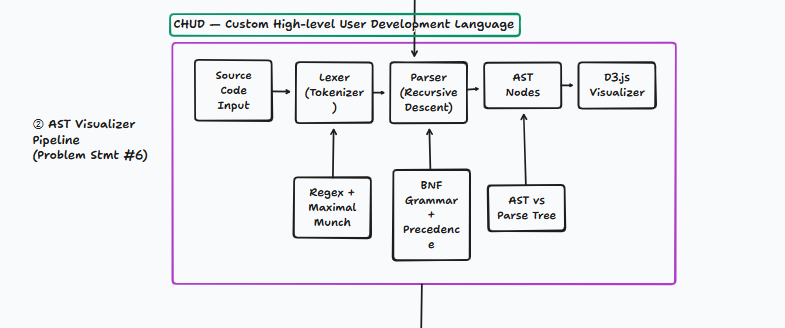

# CHUD — Custom High-level User Development Language
### Problem Statement #6: AST Visualizer Pipeline & Tree-Walk Interpreter

CHUD is a custom programming language compiler and interactive runtime environment featuring a lexer (Maximal Munch), recursive-descent parser, formal AST/CST derivation generator, tree-walk interpreter, and a browser-based D3.js visualization studio.



---

## 🌟 Language Features

- **Variables & Declarations**:
  - `let x = 10` (declare)
  - `x = x + 5` (reassign)
- **Data Types**:
  - Integers (`42`), Floats (`3.14`), Strings (`"hello"`), Booleans (`W` = true, `L` = false)
- **Operators**:
  - Arithmetic: `+`, `-`, `*`, `/`
  - Comparisons: `==`, `!=`, `<`, `>`, `<=`, `>=`
  - Unary: `-x`, `+x`
  - Automatic string concatenation with `+`
- **Control Flow**:
  - Conditionals: `check cond { ... } otherwise { ... }`
  - Loops: `keep cond { ... }`
  - Loop break: `stop`
- **I/O Operations**:
  - Output: `yap <expr>` (prints to console)
  - User Input: `hear` (reads input from user with automatic numeric casting)
- **Roast Error System**:
  - Diagnostic error handler with Gen-Z and Sigma-quote contextual roasts.

---

## 🏗️ Architecture Pipeline

```
┌──────────────────┐     ┌──────────────────┐     ┌──────────────────┐     ┌────────────────────────┐     ┌───────────────────┐
│ Source Code Input│ ──▶ │ Lexer (Tokenizer)│ ──▶ │   Parser (RD)    │ ──▶ │ AST Nodes (JSON Export)│ ──▶ │  D3.js Visualizer │
└──────────────────┘     └──────────────────┘     └──────────────────┘     └────────────────────────┘     └───────────────────┘
                                   ▲                        ▲                           ▲
                         [Regex + Maximal Munch]  [BNF Grammar + Precedence]   [AST vs Parse Tree]
```

1. **Lexer (`lexer.py`)**: Tokenizer enforcing Maximal Munch greedy matching with line tracking and keyword resolution.
2. **Parser (`parser.py`)**: Recursive descent parser enforcing operator precedence layers.
3. **AST Nodes (`ast_nodes.py`)**: Clean semantic node representations.
4. **AST Serializer (`ast_serializer.py`)**: D3.js hierarchical JSON converter.
5. **CST Generator (`cst_generator.py`)**: Lossless Concrete Syntax Tree (Parse Tree) derivation generator preserving all grammar non-terminals and concrete tokens.
6. **Interpreter (`interpreter.py`)**: Tree-walk evaluator with lexical block scoping (`Environment`), exception-based break unwinding (`BreakSignal`), and infinite loop protection.
7. **Web Server & API (`server.py`)**: 100% Python standard library HTTP server (zero pip dependencies) providing REST API endpoints (`/api/parse`, `/api/run`, `/api/all`).
8. **Visualizer Studio (`index.html`, `style.css`, `app.js`)**: Interactive D3.js web visualizer with dual AST/CST toggle, zoom/pan, collapsible nodes, token stream pills, and live console.

---

## 🚀 Quick Start

### 1. Web Visualizer Studio
Run the zero-dependency dev server:
```bash
python server.py 8000
```
Then open your browser at **`http://localhost:8000`**.

### 2. Run CHUD Programs from Terminal (CLI)
```bash
# Run the Secret Number Guessing Game
python chud.py game.chud

# Run the Sigma Rizz Evaluator
python chud.py rizz_calculator.chud

# Start an interactive CHUD REPL
python chud.py
```

### 3. Run Automated Tests
```bash
# Verify compiler, parser, AST, CST, and interpreter
python test_pipeline.py

# Verify server endpoints
python test_server.py
```

---

## 📄 Example Program (`game.chud`)

```chud
yap "======================================"
yap "    WELCOME TO THE CHUD GUESSING GAME  "
yap "======================================"

let secret = 7
let attempts = 0
let won = L

yap "I am thinking of a secret number between 1 and 10."

keep won == L {
    yap "Enter your guess: "
    let guess = hear

    attempts = attempts + 1

    check guess == secret {
        yap "W BEHAVIOR! You guessed the secret number!"
        yap "Total attempts taken: " + attempts
        won = W
        stop
    } otherwise {
        check guess < secret {
            yap "Too low! Aim higher."
        } otherwise {
            yap "Too high! Calm down bro."
        }

        check attempts >= 5 {
            yap "L behavior! You ran out of attempts."
            yap "The secret number was: " + secret
            stop
        }
    }
}

yap "Game Over. Thank you for playing CHUD!"
```
