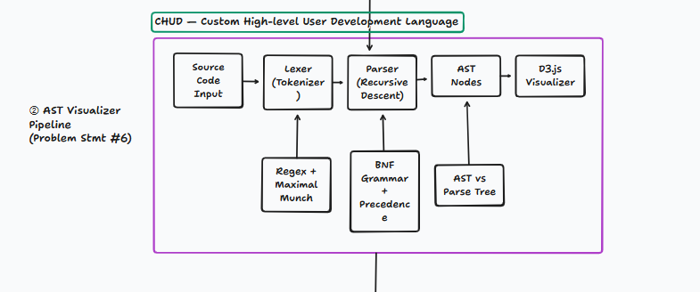
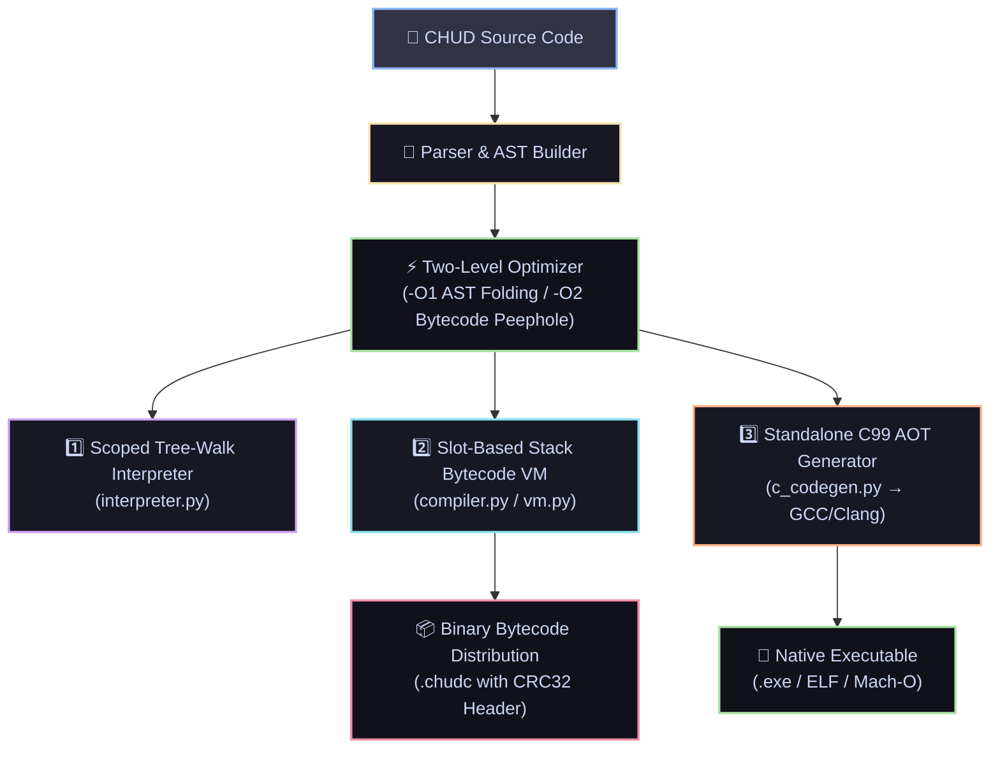

# 💻 CHUD — Custom High-level User Development Language

[](https://www.python.org/downloads/)
[-brightgreen.svg)](#-zero-external-dependencies)
[](#-universal-cross-platform-support)
[](#-universal-cross-platform-support)
[](LICENSE)

**CHUD** is a complete, educational, production-grade programming language, multi-engine compiler pipeline, and visual development workbench built entirely from scratch with **zero external dependencies**.

It transforms high-level source code through a full compiler toolchain—featuring **Maximal-Munch Lexical Analysis**, **LL(1) Recursive-Descent Parsing**, **Dual Tree Generation (CST & AST)**, **Two-Level Optimizations (AST Folding & Bytecode Peephole)**, **Triple Execution Engines** (Tree-Walk Interpreter, Fast Slot-Based Bytecode VM, and Standalone C99 AOT Native Executable Generator with 100% parity), and an interactive **Browser Studio & Tree Visualizer**.

---



---

## ⚡ Quick Start in 60 Seconds

You only need **Python 3.9+**. No `pip install` required!

### 1. 🌐 Launch the Interactive Visualizer Studio Web IDE
Launch the built-in local development server and open the interactive visual compiler workbench:
```bash
python server.py
```
👉 Open **[http://localhost:8000](http://localhost:8000)** in your browser!

*(To specify a custom port: `python server.py 8080`)*

---

### 2. 🏃 Run CHUD Programs from the Command Line

#### A. Run via Fast Bytecode Virtual Machine (Recommended)
```bash
python chud.py game.chud --vm
```
With maximum AST & Bytecode optimizations:
```bash
python chud.py game.chud --vm -O2 --opt-stats
```

#### B. Run via Scoped Tree-Walk Interpreter
```bash
python chud.py game.chud
```

#### C. Compile to a Standalone Native Binary (`.exe` on Windows / ELF binary on Linux / Mach-O on macOS)
```bash
python chud.py -c game.chud -o game.exe
./game.exe
```

#### D. Compile to Portable Binary Bytecode (`.chudc`) with CRC32 Verification
```bash
# 1. Compile source into binary bytecode
python chud.py --emit-bc game.chud -O2 -o game.chudc

# 2. Execute binary bytecode directly on the VM
python chud.py game.chudc
```

#### E. Launch the Interactive REPL
```bash
python chud.py
```
```text
╔════════════════════════════════════════════════════════════════╗
║                     CHUD Interactive REPL                      ║
║     Custom High-level User Development Language (v2.0)         ║
║     Type 'quit' or 'exit' to leave. 'help' for commands.       ║
╚════════════════════════════════════════════════════════════════╝
chud> let greeting = "Hello, World!"
chud> yap greeting
Hello, World!
chud> let user = { "name": "Chad", "score": 9000 }
chud> yap user["name"] + " -> " + user["score"]
Chad -> 9000
```

---

## 📖 Language Syntax & Tour

CHUD features an intuitive, modern syntax with expressive data structures and built-in standard library utilities:

```chud
// ─────────────────────────────────────────────
//  1. Multi-File Modules
// ─────────────────────────────────────────────
// use "math_utils.chud"

// ─────────────────────────────────────────────
//  2. Variables, Numbers, Strings, and Booleans
// ─────────────────────────────────────────────
let player_name = "Alex"
let level = 42
let is_champion = W       // 'W' = True, 'L' = False
let precision = 3.14159

// ─────────────────────────────────────────────
//  3. Dictionaries / Key-Value Hash Maps
// ─────────────────────────────────────────────
let stats = {
    "hp": 100,
    "mana": 50,
    "speed": 12.5
}
stats["hp"] = 120          // Update value
yap "Player HP: " + stats["hp"]
yap "Has mana? " + has(stats, "mana")
yap "Keys: " + keys(stats)

// ─────────────────────────────────────────────
//  4. Dynamic Arrays & Built-ins
// ─────────────────────────────────────────────
let inventory = ["Sword", "Shield", "Potion"]
push(inventory, "Bow")     // Append element
let last_item = pop(inventory)
yap "Inventory count: " + len(inventory)

// ─────────────────────────────────────────────
//  5. String Slicing & Standard Utilities
// ─────────────────────────────────────────────
let text = "   CHUD Production Engine   "
let clean = trim(text)
yap lower(clean)           // "chud production engine"
yap upper(clean)           // "CHUD PRODUCTION ENGINE"
let words = split(clean, " ")
yap "First word: " + words[0]
yap "Sliced: " + slice(clean, 0, 4)

// ─────────────────────────────────────────────
//  6. Conditionals & Logic
// ─────────────────────────────────────────────
check level >= 50 and is_champion {
    yap "Master Rank Unlocked!"
} otherwise {
    yap "Keep Grinding, " + player_name
}

// ─────────────────────────────────────────────
//  7. Loops (keep & classic loop)
// ─────────────────────────────────────────────
// While loop:
let count = 0
keep count < 3 {
    count = count + 1
    check count == 2 { skip }   // continue
    yap "Count: " + count
}

// For loop:
loop let i = 0; i < 5; i = i + 1 {
    check i == 4 { stop }       // break
    yap "Iteration: " + i
}

// ─────────────────────────────────────────────
//  8. User-Defined Functions & Recursion
// ─────────────────────────────────────────────
make calculate_power(base, exp) {
    check exp <= 0 {
        return 1
    }
    return base * calculate_power(base, exp - 1)
}
yap "2^8 = " + calculate_power(2, 8)

// ─────────────────────────────────────────────
//  9. Disk File I/O
// ─────────────────────────────────────────────
let save_file = "savegame.txt"
write_file(save_file, "Score: 9999\nLevel: 42")
check file_exists(save_file) {
    let saved_data = read_file(save_file)
    yap "Loaded Save:\n" + saved_data
}
```

---

## 🎨 Interactive Studio Web Workbench

The browser-based Studio (`python server.py` at `http://localhost:8000`) provides a visual compiler lab:

```text
┌────────────────────────────────────────┬────────────────────────────────────────┐
│ 📝 SOURCE COCKPIT & RUNTIME DRAWER     │ 🌳 VISUAL TREE & SYNTAX INSPECTOR      │
├────────────────────────────────────────┼────────────────────────────────────────┤
│ • Monaco-Style Code Editor with Gutter │ • D3.js AST & CST Interactive Graphs   │
│ • Sample Program Dropdown Selector     │ • Live Pan, Zoom & Branch Collapse     │
│ • Real-time Output & Diagnostic Log    │ • Lexical Tokens Pro Data Table View   │
│ • Live Scoped Environment Variables    │ • Collapsible JSON Tree Inspector      │
│ • Interactive Prompt Input Modal       │ • One-Click SVG & JSON File Exports    │
└────────────────────────────────────────┴────────────────────────────────────────┘
```

---

## ⚙️ The Triple Execution Engines

CHUD provides **3 interchangeable execution engines** designed for 100% identical runtime behavior:


```mermaid
flowchart TD
    Source["📄 CHUD Source Code"] --> Parser["🌳 Parser & AST Builder"]
    
    Parser --> Opt["⚡ Two-Level Optimizer<br>(-O1 AST Folding / -O2 Bytecode Peephole)"]
    
    Opt --> E1["1️⃣ Scoped Tree-Walk Interpreter<br>(interpreter.py)"]
    Opt --> E2["2️⃣ Slot-Based Stack Bytecode VM<br>(compiler.py / vm.py)"]
    Opt --> E3["3️⃣ Standalone C99 AOT Generator<br>(c_codegen.py → GCC/Clang)"]
    
    E2 --> Dist["📦 Binary Bytecode Distribution<br>(.chudc with CRC32 Header)"]
    E3 --> Native["🚀 Native Executable<br>(.exe / ELF / Mach-O)"]
    
    style Source fill:#313244,stroke:#89b4fa,stroke-width:2px,color:#cdd6f4
    style Parser fill:#181825,stroke:#f9e2af,stroke-width:2px,color:#cdd6f4
    style Opt fill:#11111b,stroke:#a6e3a1,stroke-width:2px,color:#cdd6f4
    style E1 fill:#181825,stroke:#cba6f7,stroke-width:2px,color:#cdd6f4
    style E2 fill:#181825,stroke:#89dceb,stroke-width:2px,color:#cdd6f4
    style E3 fill:#181825,stroke:#fab387,stroke-width:2px,color:#cdd6f4
    style Dist fill:#11111b,stroke:#f38ba8,stroke-width:2px,color:#cdd6f4
    style Native fill:#11111b,stroke:#a6e3a1,stroke-width:2px,color:#cdd6f4
```

1. **Tree-Walk Interpreter (`interpreter.py`)**: Traverses the AST recursively with lexical `Environment` scoping, automatic type checking, and infinite loop recursion protection.
2. **Fast Slot-Based Bytecode VM (`compiler.py`, `vm.py`, `bytecode.py`)**: Compiles AST into a linear instruction stream. Local variables and parameters are mapped to integer slots (`LOAD_FAST`, `STORE_FAST`) for direct list indexing without hash table lookups.
3. **Standalone Native C99 Compiler (`c_codegen.py`)**: Transpiles the AST into clean C99 code with an embedded runtime arena, an open-addressing hash table (`CHUD_Map`), and dynamic array memory management. Compiles to native binary executables with zero runtime dependencies.

---

## 🌐 Universal Cross-Platform Support

CHUD runs out of the box on:
- **Operating Systems**: Windows 10/11, Ubuntu / Debian / Fedora / Arch Linux, macOS (Intel & Apple Silicon).
- **Architectures**: 32-bit `x86`, 64-bit `x86_64`, `ARM32`, `ARM64` (Apple Silicon M1/M2/M3/M4), `RISC-V`.
- **Bytecode Portability**: All `.chudc` binary files use explicit little-endian fixed-width types (`<I`, `<q`, `<d`). A binary compiled on Windows runs identically on Linux or macOS.

---

## 🧪 Comprehensive Verification Suites

Run the test matrix to verify all components on your system:

```bash
# 1. Verify all 5 production language features across Interpreter, VM, and C backend
python test_production_features.py

# 2. Verify Lexer, Parser, CST, AST, Interpreter, Server, and Web IDE endpoints
python test_all.py

# 3. Verify AST constant folding & bytecode peephole optimizer
python test_optimizer.py

# 4. Verify 100% execution parity between Interpreter and Bytecode VM
python test_vm_parity.py

# 5. Verify Native C99 codegen, heap tracking, and GCC/Clang compilation
python test_native_codegen.py

# 6. Verify Binary .chudc bytecode serialization & CRC32 corruption detection
python test_bytecode_serialization.py
```

---

## 📁 Repository Directory Structure

| File Path | Description |
|---|---|
| [`lexer.py`](file:///d:/CHUD%20-%20Custom%20High-level%20User%20Development%20Language/lexer.py) | Maximal-munch regular expression lexer with exact line number tracking |
| [`parser.py`](file:///d:/CHUD%20-%20Custom%20High-level%20User%20Development%20Language/parser.py) | LL(1) recursive-descent syntax parser with precedence cascading |
| [`ast_nodes.py`](file:///d:/CHUD%20-%20Custom%20High-level%20User%20Development%20Language/ast_nodes.py) | AST data model schemas for statements, expressions, control flow, and maps |
| [`ast_optimizer.py`](file:///d:/CHUD%20-%20Custom%20High-level%20User%20Development%20Language/ast_optimizer.py) | AST-level constant folder, dead branch pruner, and algebraic simplifier |
| [`bytecode.py`](file:///d:/CHUD%20-%20Custom%20High-level%20User%20Development%20Language/bytecode.py) | Bytecode opcode set, `Chunk` container, `CallFrame`, and disassembler |
| [`compiler.py`](file:///d:/CHUD%20-%20Custom%20High-level%20User%20Development%20Language/compiler.py) | Single-pass bytecode compiler with jump backpatching and fast local slots |
| [`bytecode_optimizer.py`](file:///d:/CHUD%20-%20Custom%20High-level%20User%20Development%20Language/bytecode_optimizer.py) | Sliding-window peephole optimizer, jump threader, and dead code stripper |
| [`bytecode_serializer.py`](file:///d:/CHUD%20-%20Custom%20High-level%20User%20Development%20Language/bytecode_serializer.py) | Binary `.chudc` cross-platform serializer with CRC32 checksum verification |
| [`vm.py`](file:///d:/CHUD%20-%20Custom%20High-level%20User%20Development%20Language/vm.py) | Stack-based Virtual Machine with `CallFrame` slot indexing |
| [`interpreter.py`](file:///d:/CHUD%20-%20Custom%20High-level%20User%20Development%20Language/interpreter.py) | Scoped Tree-Walk Interpreter with lexical `Environment` chaining |
| [`c_codegen.py`](file:///d:/CHUD%20-%20Custom%20High-level%20User%20Development%20Language/c_codegen.py) | Standalone C99 AOT transpiler and native executable compiler |
| [`chud.py`](file:///d:/CHUD%20-%20Custom%20High-level%20User%20Development%20Language/chud.py) | Unified CLI tool for running, compiling, optimizing, and REPL |
| [`server.py`](file:///d:/CHUD%20-%20Custom%20High-level%20User%20Development%20Language/server.py) | Zero-dependency HTTP server hosting the visualizer studio and REST API |
| [`index.html`](file:///d:/CHUD%20-%20Custom%20High-level%20User%20Development%20Language/index.html) | Split-pane Studio Web IDE user interface |
| [`style.css`](file:///d:/CHUD%20-%20Custom%20High-level%20User%20Development%20Language/style.css) | Modern IDE styling, responsive layouts, and multi-theme palette |
| [`app.js`](file:///d:/CHUD%20-%20Custom%20High-level%20User%20Development%20Language/app.js) | Frontend controller managing D3 tree graphs, tables, and API sync |
| [`test_production_features.py`](file:///d:/CHUD%20-%20Custom%20High-level%20User%20Development%20Language/test_production_features.py) | Test suite for Hash Maps, File I/O, String Utils, Modules, and Slot VM |
| [`test_all.py`](file:///d:/CHUD%20-%20Custom%20High-level%20User%20Development%20Language/test_all.py) | End-to-end integration test suite |
| [`test_optimizer.py`](file:///d:/CHUD%20-%20Custom%20High-level%20User%20Development%20Language/test_optimizer.py) | Optimization verification test suite |
| [`test_vm_parity.py`](file:///d:/CHUD%20-%20Custom%20High-level%20User%20Development%20Language/test_vm_parity.py) | Automated parity test suite for Interpreter vs. Bytecode VM |
| [`test_native_codegen.py`](file:///d:/CHUD%20-%20Custom%20High-level%20User%20Development%20Language/test_native_codegen.py) | Native C99 compilation and execution test suite |
| [`test_bytecode_serialization.py`](file:///d:/CHUD%20-%20Custom%20High-level%20User%20Development%20Language/test_bytecode_serialization.py) | Binary `.chudc` serialization and checksum validation tests |

---

## 📄 License

CHUD is open-source software licensed under the [MIT License](LICENSE).
